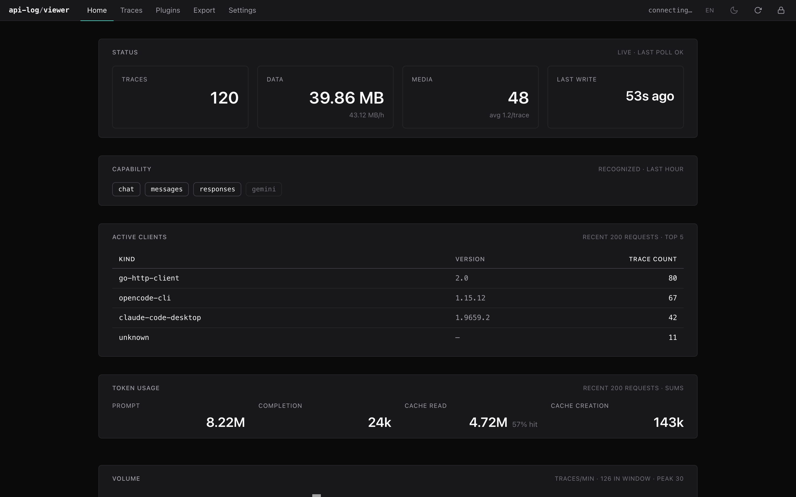
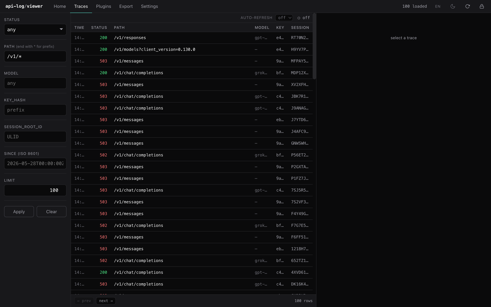
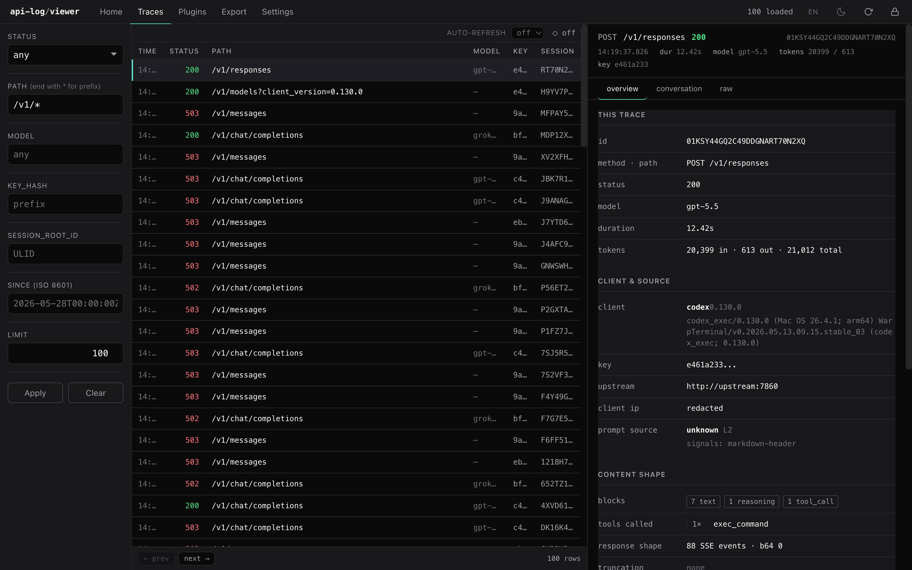
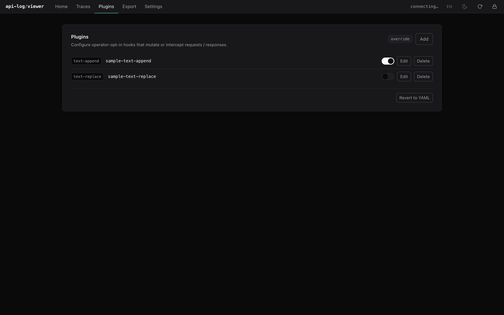

[English](README.md) | 中文

# api-log-viewer: Svelte trace viewer for LLM proxy logs

[](https://github.com/xiayangzhang/api-log-viewer/actions/workflows/ci.yml)
[](https://github.com/xiayangzhang/api-log-viewer/releases)
[](./LICENSE)
[](#bundle-size)

api-log-viewer 是 [api-log](https://github.com/xiayangzhang/api-log) trace
的 Svelte 5 浏览器 UI。它读取 api-log 的 HTTP read API，展示已录制的 LLM
请求、响应、SSE chunk、tool call、reasoning 内容、session 与 replay 数据，
gateway 抓包与存储仍然交给独立的 api-log 后端。

## Screenshots

**Home** —— 聚合仪表盘：trace / 数据 / media 体量、识别到的协议、
活跃客户端（按 client header 解析）、token 用量、流量曲线。



**Traces** —— 列表视图 + 筛选侧栏（status、path 支持 `*` 前缀、
model、key 前缀、session、since、limit），键盘友好的表格行。点一行
打开右侧 detail 面板。



**Trace detail (Overview tab)** —— 请求 / 响应身份信息、token 入 /
出、耗时、客户端 / key / upstream、内容形状（text / reasoning /
tool-call 计数）。Conversation 与 Raw tab 在同一面板的相邻 tab。



**Plugins** —— operator opt-in 的 mutate / intercept hook。每个
实例独立 enable toggle，通过后端 PUT / PATCH / DELETE API 热加载
（无需重启）。YAML 默认 + runtime override 两层，source pill 表示
当前行的真值来源。



## Works with api-log

本查看器是 api-log HTTP read API 之上的一层薄读取端。它不抓包、不路由、不
存储、不改写流量。所有录制工作都由后端完成；read API 的契约见 api-log 仓
库的 `ARCHITECTURE.md § 6`。

### Backend version

- 本 release 对齐 `api-log >= 0.1.0`。该线的 wire contract（read API +
  trace JSON 结构）在补丁版本之间保持稳定。
- minor 版本的后端升级可能新增字段；查看器会忽略未知字段而不是直接 fail
  closed。

### API base URL

查看器只与单个后端 origin 通信。开发态下 `/api/*` 与 `/healthz` 会代理到
`$APILOG_BACKEND`（默认 `http://127.0.0.1:7862`）。生产态的典型部署是把
静态 bundle 与 `/api/*` + `/healthz` 反代放在同一域名下，从而完全规避
CORS。

### Hash-router deployment

路由基于 hash（`#/landing`、`#/traces`、`#/traces/<id>`）。bundle 是一个
SPA —— 任何能在 `/` 返回 `index.html` 的静态文件服务器都够用；不需要任何
rewrite 规则。

## Quick start

### Develop locally

```sh
pnpm install
pnpm dev
```

监听 `http://localhost:5180`。Vite 会把 `/api/*` 与 `/healthz` 代理到
`$APILOG_BACKEND`（默认 `http://127.0.0.1:7862`）。

### Connect to a backend

先启动 api-log 后端（见其
[Quick start](https://github.com/xiayangzhang/api-log#quick-start)），然
后让查看器指向它：

```sh
APILOG_BACKEND=http://127.0.0.1:7862 pnpm dev
```

首次加载时查看器会要求填入 admin bearer token。后端首次启动时把该 token
写入 `./data/admin_token`；把内容粘贴进认证弹窗即可。token 存放在
`localStorage` 中（已兼容 Safari 隐私模式与沙箱化 iframe —— 即便存储不可
用模块加载也不会再 crash）。

## Views

5 个顶层页面，均通过 hash route 寻址：

| Route | Page | What it shows |
|---|---|---|
| `#/landing` | Home | 后端健康、近期 trace 概要、入口跳转 |
| `#/traces` | Traces | 已录制 trace 的列表 + 过滤器 + 详情面板 |
| `#/plugins` | Plugins | text-replace、text-append、path-filter 插件的 CRUD UI |
| `#/export` | Export | 按过滤条件打包成可下载 zip，供离线分析 |
| `#/settings` | Settings | 主题、语言（en / zh）、bearer token、关于 |

### Trace list

`#/traces` 渲染 `GET /api/traces` 的结果，侧边栏提供过滤输入：status code、
path（精确或 `prefix/*`）、model、`key_hash`、`session_root_id`、`since`、
`limit`。datalist 候选从当前已加载页面里观察到的取值中归纳。

### Trace detail

选中一行会打开详情面板，包含三个 tab：

| Tab | Contents |
|---|---|
| Overview | identity、status、latency、model、tool-call 概要、reasoning 概要，以及当录制时附带的 `AGENTS.md` / `CLAUDE.md` 中提取的 project context |
| Conversation | 渲染后的消息 —— system / user / assistant / tool 块、SSE replay、tool-call 入参与结果 |
| Raw | 请求 headers + body 与响应 headers + body 放在一起，单 tab，避免运维来回切 tab |

`Headers` 与 `Body` 已合并进 Raw tab，让 diff 风格阅读集中在一处。SSE
replay 渲染在 Conversation 内部，而非单独 tab。

### Plugins

Plugins 页面按分类（text-replace / text-append / path-filter）列出已配置
的插件，提供逐项 enable / edit / delete，并调用后端的
`PUT /api/config/plugins/:id`、`PATCH …/enabled` 与 `DELETE …`。后端的
hot-reload 会在不重启的情况下吃掉这些变更。

### Export

Export 页面让运维施加一组 trace 过滤条件，然后下载一个 zip 包（trace +
对应 JSONL + 任何 project-context 文件），方便下游 agent 离线 ingest。

## Deploy

### Static build

```sh
pnpm build
# dist/ contains the static SPA bundle
```

构建产物是一个 bundle（一个 HTML + 带 hash 的 JS/CSS）。CI 自动测量
bundle 体积，目前大约 77 KB JS gzipped —— 小到只需做激进的 CDN 缓存这一
项性能工作。

### Caddy reverse proxy

把静态 bundle 与后端反代放在同一 origin 下，规避 CORS：

```caddyfile
your.domain {
  root * /opt/api-log-viewer/dist
  file_server
  handle /api/*   { reverse_proxy 127.0.0.1:7862 }
  handle /healthz { reverse_proxy 127.0.0.1:7862 }
}
```

### Nginx reverse proxy

```nginx
server {
  listen 443 ssl;
  server_name your.domain;

  root /opt/api-log-viewer/dist;
  index index.html;

  location / {
    try_files $uri /index.html;
  }

  location /api/    { proxy_pass http://127.0.0.1:7862; }
  location /healthz { proxy_pass http://127.0.0.1:7862; }
}
```

## Security notes

- admin bearer token 存放在 `localStorage` 里。任何能访问查看器 origin
  DOM 的人都可以读到它；在共享部署里要把查看器 origin 视为可信，并在外
  层加 gate（mTLS、VPN、反代层的 basic auth）。
- 查看器从不把已录制的流量再发往真实上游。Conversation tab 的 SSE
  replay 是已录制字节的渲染，不是实时请求。
- 查看器自身不做脱敏。它展示的就是后端录到的东西；抓包侧的脱敏姿态见
  api-log 的 `SECURITY.md`。

## Compatibility

| Component | Version |
|---|---|
| api-log backend | `>= 0.1.0` |
| Node | `>= 22` (CI matrix: 22.x) |
| pnpm | `>= 9` |
| Browsers | Chrome / Firefox / Safari 的最近两个版本 |

## Bundle size

CI 会在每次构建时测量 gzip 后的 JS 体积。截至 `0.1.0`，bundle 约 77 KB JS
gzipped、141 个源文件、SPA 单 bundle。

## Development

```sh
pnpm install
pnpm check        # svelte-check
pnpm test         # tsx-driven unit tests
pnpm build        # production bundle into dist/
pnpm dev          # dev server on :5180
```

CI 在 push 与 pull request 上跑 `check + test + build`；`v*` tag 会构建
release artifact。见 `.github/workflows/ci.yml`。

技术内核：

- Svelte 5（runes）+ Vite + TypeScript。
- 不引入 CSS 框架、组件库、客户端 router 库。
- i18n 是 `src/lib/i18n/{en,zh}.ts` 中的字典，运行时切换。
- 所有后端调用走 `src/lib/api.ts`，由它统一处理 bearer 注入、
  401 → 认证弹窗，以及 `PluginAPIError` 的 `{error, detail}` 信封。

## Related projects

- [api-log](https://github.com/xiayangzhang/api-log) —— 本查看器读取的
  Go 录制 proxy。其 HTTP read API 契约见仓库内的
  `ARCHITECTURE.md § 6`。
- [`SECURITY.md`](./SECURITY.md) —— 查看器侧的威胁模型。
- [`CHANGELOG.md`](./CHANGELOG.md) —— release notes。

## Acknowledgements

### Backend + design influence

- [`api-log`](https://github.com/xiayangzhang/api-log) —— 这个查看器
  的每个面板都在渲染后端已经录好的东西；read API 契约决定了每一页的形状。
- **Svelte 5 (runes)** —— module-level `$state` cell 让 i18n / 主题 /
  认证态这些容易 desync 的小型全局状态不需要 store library 就能写干净。

### Development assistance

本项目代码与文档由 **Claude Opus 4.8**（Anthropic）作为 Phase L UI 重做、
插件管理面、i18n 字典、localStorage 兜底加固以及这份 README 的主要
pair-programmer 完成，并由 **GPT-5.5**（通过 Codex CLI）作为 research
+ review 助手——发布前 adversarial review、对照 OSS 参考项目
（CLIProxyAPI、sub2api、cc-switch）的 README 结构分析、tone 校对。
保留 / 删除 / 修订的判断由人类作者负责；这里列出 AI 协助是为了透明，
不是 authorship。

## License

[MIT](./LICENSE) — Copyright 2026 Leo Yun.
